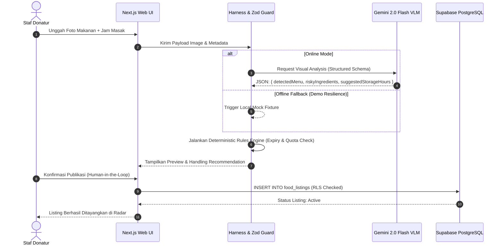
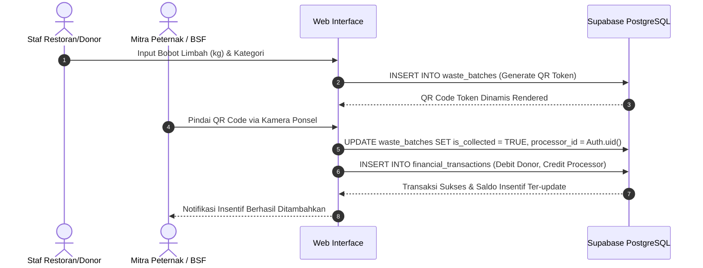
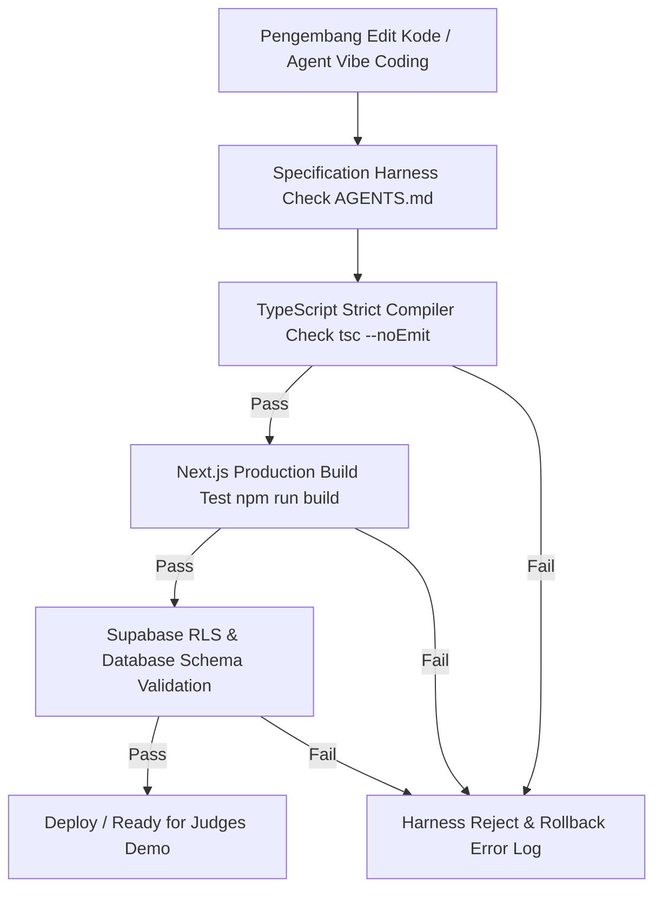

# System Architecture & Harness Engineering Document: SiklusPangan

**Versi Dokumen:** 1.0.0  
**Target Platform:** Next.js 15 (App Router, React 19, TypeScript)  
**Database:** Supabase (PostgreSQL 15 + RLS + Realtime)  
**AI Model:** Google Gemini 2.0 Flash VLM (`@google/genai`)  
**Metodologi Rekayasa:** Harness-Driven Vibe Coding  

---

## 1. Ringkasan Arsitektur Sistem

**SiklusPangan** dibangun menggunakan arsitektur modular terdesentralisasi (*Decoupled Server Actions Architecture*) yang dikelilingi oleh **Harness Scaffold Boundary**. Seluruh interaksi pengguna, pemrosesan visual AI, dan transaksi logistik terbalik melalui 5 lapisan utama:

```
+-----------------------------------------------------------------------------------+
| 1. PRESENTATION LAYER (Next.js 15 Client Components, Tailwind CSS, html5-qrcode)  |
+-----------------------------------------------------------------------------------+
                                        | (Server Actions & Mutasi Typed Zod)
+-----------------------------------------------------------------------------------+
| 2. HARNESS GUARD & RULES ENGINE (Deterministic Expiry Guard, Quota & Dispute)    |
+-----------------------------------------------------------------------------------+
          |                                                       |
          v (Structured JSON Prompt)                              v (PostgreSQL Client)
+------------------------------------+          +-----------------------------------+
| 3. AI MULTIMODAL LAYER             |          | 4. PERSISTENCE & BAAS LAYER       |
|    Google Gemini 2.0 Flash VLM     |          |    Supabase (PostgreSQL 15 + RLS)|
+------------------------------------+          +-----------------------------------+
                                                          |
                                                          v (Realtime Engine)
                                                +-----------------------------------+
                                                | 5. REALTIME RADAR & DASHBOARDS    |
                                                +-----------------------------------+
```

---

## 2. Rincian Lapisan Arsitektur (*Architectural Layers*)

### 2.1 Lapisan Presentasi (*Presentation Layer*)
* **Framework:** Next.js 15 App Router menggunakan React 19 (Server & Client Components).
* **Komponen & UI:** Tailwind CSS v3 + `shadcn/ui` (Radix UI primitives).
* **Pemindai Kamera:** `html5-qrcode` yang dieksekusi langsung di peramban seluler pengguna tanpa dependensi server.
* **Manajemen State Client:** React State & Server Action Pending states (`useActionState`, `useTransition`).

### 2.2 Lapisan Harness Guard & Business Logic
* **Specification Harness:** Mengunci kontrak data menggunakan Zod v3.
* **Deterministic Rules Engine:**
  * **Food Expiry Calculator:** Menghitung `safe_until = cooked_at + Min(suggestedStorageHours, MaxAllowedHoursByRules)`.
  * **Quota Guard:** Memastikan 1 klaim per akun per periode makan (Siang: 11.00–14.00, Malam: 17.00–20.00).
  * **Orphanage Threshold Rerouter:** Mengalihkan alokasi makanan panti asuhan ke radar individu jika ketersediaan $< 50\%$ kapasitas panti.
* **ESG & Impact Calculator:** Perhitungan reduksi emisi metana ($CH_4$) dan $CO_2e$ secara deterministik.

### 2.3 Lapisan Multimodal AI Infrastructure
* **SDK:** `@google/genai` resmi.
* **Model:** `gemini-2.0-flash`.
* **Structured Output Enforcement:** Menggunakan `responseSchema` dari Zod yang dikonversi ke JSON Schema standar untuk menjamin luaran berbentuk objek JSON murni tanpa *markdown wrapper*.

### 2.4 Lapisan Data & Basis Data (*Persistence & BaaS*)
* **Database Engine:** Supabase PostgreSQL 15.
* **Keamanan:** Row Level Security (RLS) diaktifkan penuh di tingkat tabel database.
* **Otentikasi:** Supabase Auth (Magic Link Passwordless & Email/Password).
* **Realtime Engine:** Supabase Realtime Channels untuk sinkronisasi instan *Live Surplus Radar*.

---

## 3. Diagram Alur Transaksi & Harness (Mermaid Diagrams)

### 3.1 Diagram 1: Surplus Food Scanning & Deterministic Safety Classification



---

### 3.2 Diagram 2: Biokonversi Limbah & Reverse Tipping Fee Handover



---

### 3.3 Diagram 3: Harness Verification & CI Pipeline Flow



---

## 4. Model Keamanan Data & Kebijakan Row Level Security (RLS)

Sistem menerapkan model **Least Privilege Access** di tingkat basis data PostgreSQL:

| Nama Tabel | Peran (Role) | Hak Akses (Privilege) | Kondisi Kebijakan (RLS Policy Condition) |
|---|---|---|---|
| `profiles` | `authenticated` | `SELECT` | `true` (dapat dilihat pengguna terautentikasi) |
| `profiles` | `authenticated` | `UPDATE` | `auth.uid() = id` (hanya edit profil sendiri) |
| `food_listings` | `anon` / `authenticated` | `SELECT` | `status = 'active'` (listing aktif publik) |
| `food_listings` | `donor` | `ALL` | `auth.uid() = donor_id` |
| `food_claims` | `beneficiary` | `INSERT` | `auth.uid() = claimant_id` |
| `food_claims` | `beneficiary` / `donor` | `SELECT` | `auth.uid() = claimant_id OR donor_id = auth.uid()` |
| `waste_batches` | `donor` / `processor` | `SELECT` | `auth.uid() = donor_id OR auth.uid() = processor_id OR processor_id IS NULL` |
| `financial_transactions` | `authenticated` | `SELECT` | `auth.uid() = user_id` |

---

## 5. Resilience & Offline Fallback Strategy (TCC 2026 UTM Demo)

Untuk menjamin presentasi luring di Universitas Trunojoyo Madura berjalan $100\%$ tanpa hambatan teknis:
1. **Network Interceptor:** Modul Next.js Server Action dibungkus dengan utilitas `withFallbackHarness()`.
2. **Timeout Enforcement:** Batas waktu panggilan API Gemini dan Supabase ditetapkan maksimal $3000\text{ ms}$.
3. **Mock Storage:** Jika jaringan aula penjurian terputus, sistem secara otomatis mengambil data simulasi (*fixtures*) dari `localStorage` atau *static JSON fallback*, memastikan UI pemindai dan radar tetap merespons secara mulus di hadapan dewan juri.
