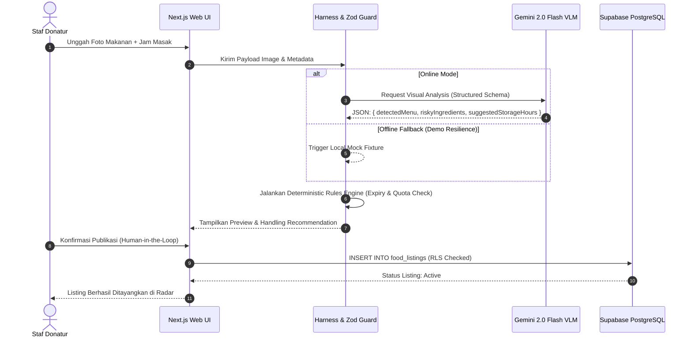
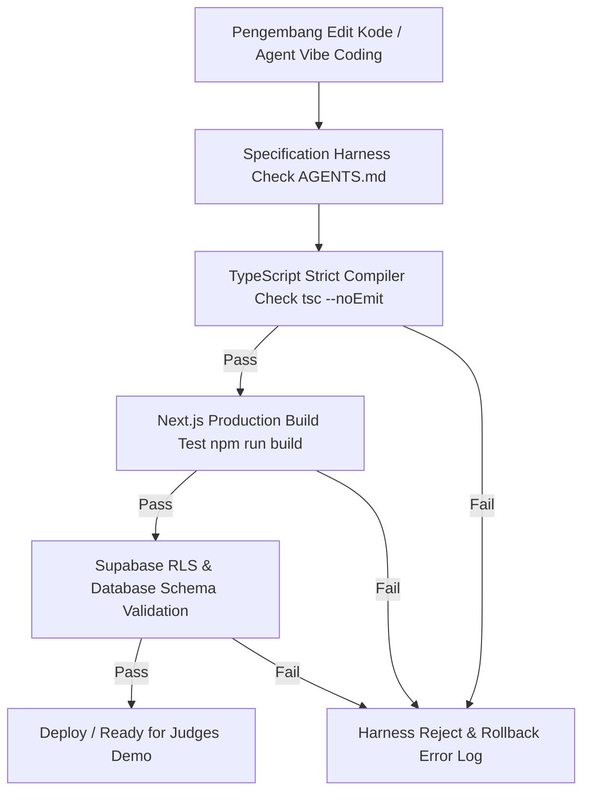

# System Architecture & Harness Engineering Document: SiklusPangan

**Versi Dokumen:** 1.0.0  
**Target Platform:** Next.js 15 (App Router, React 19, TypeScript)  
**Database:** Supabase (PostgreSQL 15 + RLS + Realtime)  
**AI Model:** Google Gemini 2.0 Flash VLM (`@google/genai`)  
**Metodologi Rekayasa:** Harness-Driven Vibe Coding  

---

## 1. Ringkasan Arsitektur Sistem

**SiklusPangan** dibangun menggunakan arsitektur modular terdesentralisasi (*Decoupled Server Actions Architecture*) yang dikelilingi oleh **Harness Scaffold Boundary**. Seluruh interaksi pengguna, pemrosesan visual AI, dan transaksi logistik terbalik melalui 5 lapisan utama:

```
+-----------------------------------------------------------------------------------+
| 1. PRESENTATION LAYER (Next.js 15 Client Components, Tailwind CSS, html5-qrcode)  |
+-----------------------------------------------------------------------------------+
                                        | (Server Actions & Mutasi Typed Zod)
+-----------------------------------------------------------------------------------+
| 2. HARNESS GUARD & RULES ENGINE (Deterministic Expiry Guard, Quota & Dispute)    |
+-----------------------------------------------------------------------------------+
          |                                                       |
          v (Structured JSON Prompt)                              v (PostgreSQL Client)
+------------------------------------+          +-----------------------------------+
| 3. AI MULTIMODAL LAYER             |          | 4. PERSISTENCE & BAAS LAYER       |
|    Google Gemini 2.0 Flash VLM     |          |    Supabase (PostgreSQL 15 + RLS)|
+------------------------------------+          +-----------------------------------+
                                                          |
                                                          v (Realtime Engine)
                                                +-----------------------------------+
                                                | 5. REALTIME RADAR & DASHBOARDS    |
                                                +-----------------------------------+
```

---

## 2. Rincian Lapisan Arsitektur (*Architectural Layers*)

### 2.1 Lapisan Presentasi (*Presentation Layer*)
* **Framework:** Next.js 15 App Router menggunakan React 19 (Server & Client Components).
* **Komponen & UI:** Tailwind CSS v3 + `shadcn/ui` (Radix UI primitives).
* **Pemindai Kamera:** `html5-qrcode` yang dieksekusi langsung di peramban seluler pengguna tanpa dependensi server.
* **Manajemen State Client:** React State & Server Action Pending states (`useActionState`, `useTransition`).

### 2.2 Lapisan Harness Guard & Business Logic
* **Specification Harness:** Mengunci kontrak data menggunakan Zod v3.
* **Deterministic Rules Engine:**
  * **Food Expiry Calculator:** Menghitung `safe_until = cooked_at + Min(suggestedStorageHours, MaxAllowedHoursByRules)`.
  * **Quota Guard:** Memastikan 1 klaim per akun per periode makan (Siang: 11.00–14.00, Malam: 17.00–20.00).
  * **Orphanage Threshold Rerouter:** Mengalihkan alokasi makanan panti asuhan ke radar individu jika ketersediaan $< 50\%$ kapasitas panti.
* **ESG & Impact Calculator:** Perhitungan reduksi emisi metana ($CH_4$) dan $CO_2e$ secara deterministik.

### 2.3 Lapisan Multimodal AI Infrastructure
* **SDK:** `@google/genai` resmi.
* **Model:** `gemini-2.0-flash`.
* **Structured Output Enforcement:** Menggunakan `responseSchema` dari Zod yang dikonversi ke JSON Schema standar untuk menjamin luaran berbentuk objek JSON murni tanpa *markdown wrapper*.

### 2.4 Lapisan Data & Basis Data (*Persistence & BaaS*)
* **Database Engine:** Supabase PostgreSQL 15.
* **Keamanan:** Row Level Security (RLS) diaktifkan penuh di tingkat tabel database.
* **Otentikasi:** Supabase Auth (Magic Link Passwordless & Email/Password).
* **Realtime Engine:** Supabase Realtime Channels untuk sinkronisasi instan *Live Surplus Radar*.

---

## 3. Diagram Alur Transaksi & Harness (Mermaid Diagrams)

### 3.1 Diagram 1: Surplus Food Scanning & Deterministic Safety Classification



---

### 3.2 Diagram 2: Biokonversi Limbah & Reverse Tipping Fee Handover

```mermaid
sequenceDiagram
    autonumber
    actor Donor as Staf Restoran/Donor
    actor Processor as Mitra Peternak / BSF
    participant WebApp as Web Interface
    participant DB as Supabase PostgreSQL

    Donor->>WebApp: Input Bobot Limbah (kg) & Kategori
    WebApp->>DB: RPC create_waste_batch (session donor, token acak)
    DB-->>WebApp: QR Code Token Dinamis Rendered
    
    Processor->>WebApp: Pindai QR Code via Kamera Ponsel
    WebApp->>DB: RPC process_waste_handover(token), transaksi atomik
    DB->>DB: Lock batch/profiles/subsidy, hitung Rp600/kg
    DB->>DB: Subsidi lifetime Rp12000 lalu debit deposit SEMUA mode; saldo kurang ditolak
    DB->>DB: Kredit penuh processor dan ledger once
    DB-->>WebApp: Transaksi Sukses & Saldo Insentif Ter-update
    WebApp-->>Processor: Notifikasi Insentif Berhasil Ditambahkan
```

---

### 3.3 Diagram 3: Harness Verification & CI Pipeline Flow



---

## 4. Model Keamanan Data & Kebijakan Row Level Security (RLS)

Sistem menerapkan model **Least Privilege Access** di tingkat basis data PostgreSQL:

| Objek | Akses aktual setelah 0003 |
|---|---|
| profiles | SELECT sendiri/admin; UPDATE hanya display_name, phone_number, address + RLS |
| food_listings | SELECT donor sendiri/admin; INSERT donor aktif dengan guard expiry/stock; UPDATE/DELETE client dicabut |
| food_radar | SELECT anon/authenticated, proyeksi tanpa donor_id, hanya stok aman aktif |
| food_claims | SELECT peserta/admin; claim hanya RPC atomik, kuota Asia/Jakarta; collection RPC belum ada |
| waste_batches | SELECT donor/processor terkait/admin; create/handover hanya RPC |
| strike_disputes | SELECT pihak terkait/admin; submit hanya RPC, penalti menunggu FHR-18 |
| financial_transactions | SELECT sendiri/admin; ledger ditulis RPC |
| donor_subsidies | SELECT donor sendiri/admin; tidak dapat ditulis client |

RPC: `claim_food_token`, `create_waste_batch`, `process_waste_handover`, `submit_dispute_strike`. EXECUTE hanya authenticated (bukan anon/PUBLIC), role diperiksa di dalam fungsi. RLS tetap aktif; security-definer memerlukan guard eksplisit. Sumber kebenaran: migration files, bukan tabel rancangan lama.

Phase3 IN PROGRESS: review lokal tidak menerapkan migration. Verifikasi katalog DB read-only gagal terkoneksi; fixture ID sesi sebelumnya tidak ditemukan lewat service-role SELECT PostgREST. Ini tidak membuktikan cleanup atau RLS. Live in-window individual quota dan jalur collection belum terbukti. Radar menghilangkan kolom identitas, tetapi teks/foto donor masih dapat mengungkap identitas.

---

## 5. Resilience & Offline Fallback Strategy (rancangan, bukan bukti implementasi)

Mutasi finansial/klaim tidak boleh melaporkan sukses dari fixture fallback; timeout wajib memeriksa riwayat transaksi.

Untuk menjamin presentasi luring di Universitas Trunojoyo Madura berjalan $100\%$ tanpa hambatan teknis:
1. **Network Interceptor:** Modul Next.js Server Action dibungkus dengan utilitas `withFallbackHarness()`.
2. **Timeout Enforcement:** Batas waktu panggilan API Gemini dan Supabase ditetapkan maksimal $3000\text{ ms}$.
3. **Mock Storage:** Jika jaringan aula penjurian terputus, sistem secara otomatis mengambil data simulasi (*fixtures*) dari `localStorage` atau *static JSON fallback*, memastikan UI pemindai dan radar tetap merespons secara mulus di hadapan dewan juri.

## Update final NO DEBT / collection (0004)

Migrasi `0004_no_debt_collection.sql` deployed, TLS verified; 0003 unchanged. Semua handover memakai subsidi lalu deposit; saldo kurang ditolak. `paid_at IS NOT NULL` wajib untuk rekap invoice lunas; tanpa backfill historis. Dispute lock profil sebelum listing; `collectFoodClaim` donor-only, idempotent, tersedia. Organisasi tetap self-declared (risiko signup abuse diterima).

Rollback SQL integration dan readback katalog lulus; bukan Auth/PostgREST E2E atau race multi-session. Deposit posting/payment provider/pencairan belum tersedia; saldo tidak client-writable. UI dan FHR-18 belum selesai, Phase3 IN PROGRESS. Tidak ada cleanup/delete/commit/push. Bukti, perintah, batas verifikasi: `docs/PHASE3_VERIFICATION.md`. Catatan review sebelumnya bersifat historis.
